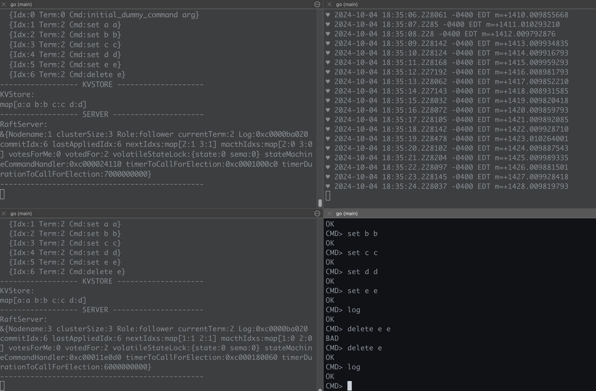

# rft

## Overview

This (partial) implementation of the [RAFT consensus algorithm](https://raft.github.io/),
that I wrote while taking the [Rafting Trip course](https://www.dabeaz.com/raft.html) (which I highly recommend!).

### Prerequisites

- Go.

### Steps to run

1. Clone this repo.

2. Run up to three Raft nodes (as a `follower` or `leader`) identified by either `1`, `2`, or `3`.

   ```bash
   # Start a raft server [identified by number 1] as a leader:
   go run example/server/main.go 1 leader
   ```

   ```bash
   # Start a raft server [identified by number 2] as a follower:
   go run example/server/main.go 2 follower
   ```

3. Connect to either node (identified by either `1`, `2`, or `3`) using the client app.
   ```bash
   # Connect to a raft server [identified by number 2] with the client app:
   go run example/client/main.go 3
   ```

See the demo here (you can click on the image):
[](https://youtu.be/qLMGLG2ZKCA)
